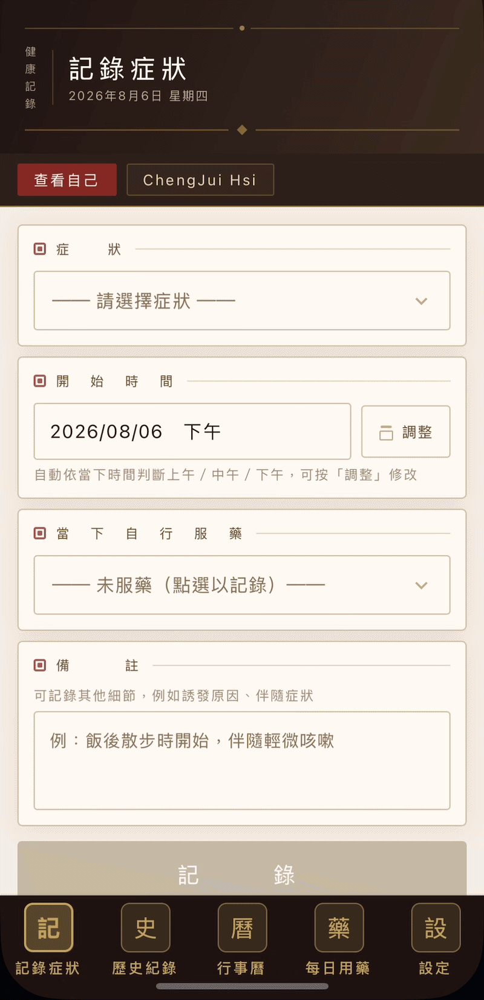
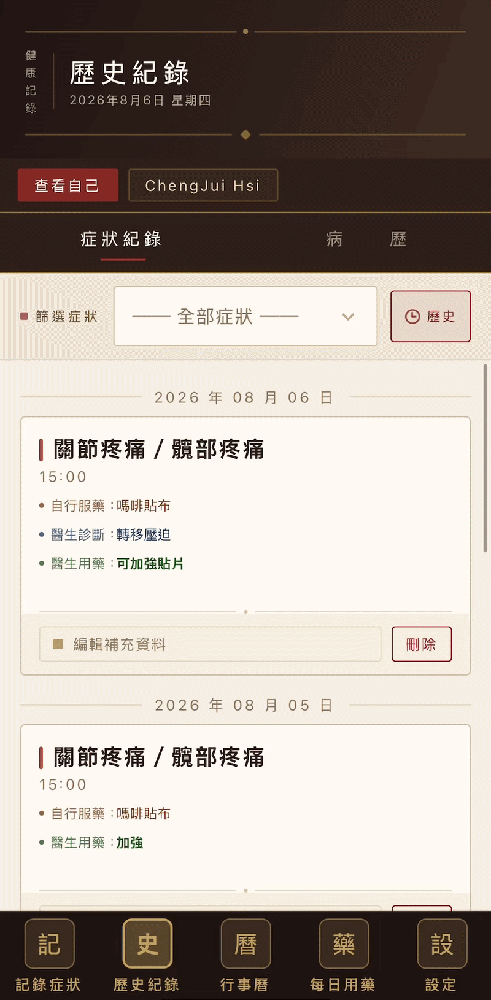
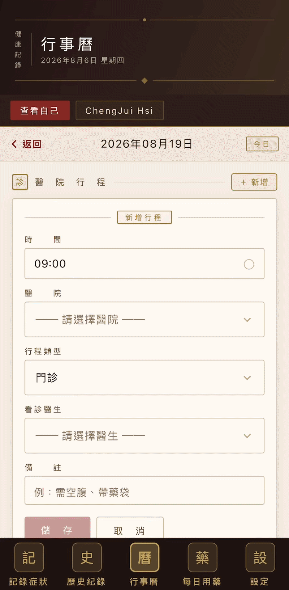
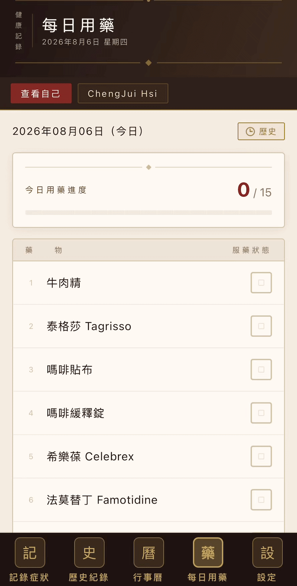
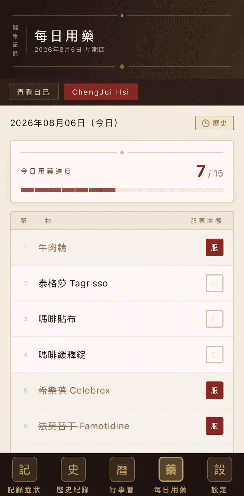
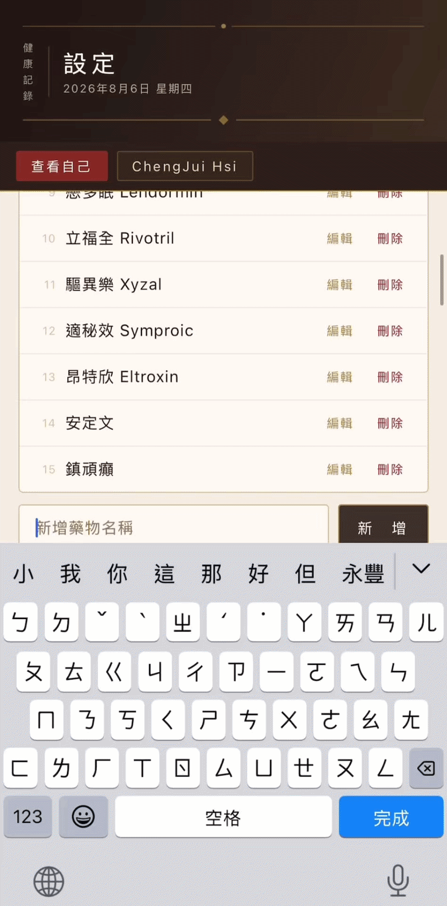
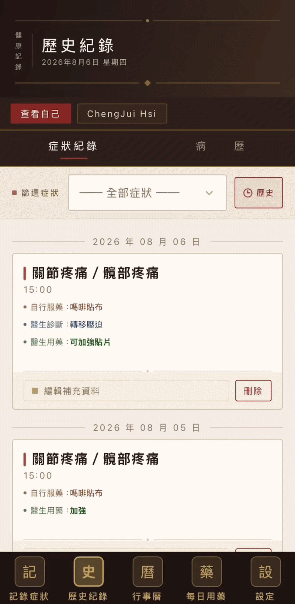

# HealthAppFresh

A caregiving app that helps cancer patients organize symptoms, appointments, and medications, so every doctor visit starts with clear answers instead of guesswork.

## Why this exists

This app is inspired by my dad, a stage-four lung cancer patient who struggled to organize his symptoms and communicate them clearly to his doctors. Patients like him often deal with multiple, overlapping issues and have to see several specialists, sometimes across different departments or even different hospitals. He lacked a proper tool to record what he was experiencing in a way he could actually bring back to each doctor.

## Who it's for

**Primary user: my dad.** The app gives him a single place to log his hospital schedules, separate from his everyday calendar, and lets him filter past appointments by type. For example, if his doctor asks what MRIs he's had in the last 12 months, he can answer immediately instead of digging through a generic calendar app day by day. Each appointment also has a space to jot down questions he wants to ask before the visit, so the question and the eventual answer stay in one place instead of being scattered across a notes app and a calendar. Dropdowns instead of free text matter here too: they prevent typos and keep terminology consistent, which helps an elderly patient who may find it tiring to type everything out or may simply forget.

**Secondary users: family members and caretakers.** They can view the patient's records with a read-only invite code. This is useful when they take turns accompanying him to appointments and need to quickly get up to speed. If the patient genuinely can't record entries themselves, a family member can log into their account directly and edit on their behalf, so the app doesn't force a false choice between "read-only" and "someone else has to do it for them."

## Feature walkthrough

**Symptom log + history.** Log a symptom the moment it happens, timestamped automatically, so the patient always has an exact answer when the doctor asks when it started.

Every saved entry flows into History, where the patient can add what the doctor said in response, building a searchable record filterable by symptom.

**Calendar (with visit notes).** Track every appointment by hospital and type (MRI, CT, blood test, etc.), with a space to jot down questions before the visit so nothing gets forgotten in the room.

**Daily medication.** Check off each dose as it's taken and get notified for scheduled doses. Reminders aren't limited to simple daily pills; time-sensitive medications on non-daily cycles are scheduled precisely too, so nothing gets missed even when the app isn't open.

Past intake can also be reviewed two ways: by date, looking back up to 7 days, or by medication, to quickly check whether a specific drug was taken at all within the last 7 days.

**Settings.** Every dropdown in the app (symptoms, medications, hospitals, appointment types, doctor names, drug allergies) is managed from one place and fully editable by the user.

**Viewer mode.** Family members view the patient's records read-only with an invite code, so anyone taking a turn at care can get up to speed in seconds.

## A few design choices worth mentioning

**Why every dropdown is user-editable instead of a fixed list.** Cancer patients are vulnerable to a wide range of side effects, and they rarely know in advance what they'll need to track next or which specialist they'll end up seeing for it. A fixed list would fall out of date the moment a new symptom or medication appeared, so every dropdown in this app is built to be extended by the user as their situation changes.

**Why symptom entries ask what the patient took to relieve it.** This is a question doctors ask routinely, and if it isn't a structured field, patients are likely to forget the detail by the time they're in the appointment. Capturing it at the moment of the symptom, rather than relying on memory later, also gives doctors a more accurate basis for diagnosis.

**Why viewer mode is read-only instead of shared editing.** The app is designed around the patient being capable of recording their own information. The problem was never that they couldn't record it, but that no existing tool organized it well enough. Read-only viewing lets family members stay informed without the ambiguity of multiple people editing the same record. For situations where the patient genuinely needs help entering data, the app doesn't try to build a shared-editing model on top of that assumption. A family member can just log in directly with the patient's account and edit on their behalf, which is simpler and avoids attribution confusion.

## What's next

The core app is stable after 38 builds. The next planned feature is auto-scan: letting a patient photograph a medication label or an appointment slip from the hospital, so the app can extract and fill in the relevant fields automatically, saving time and reducing the chance of manual-entry typos.

## Tech stack

Built with React Native and Expo, backed by Supabase (PostgreSQL) for cloud sync and authentication (Apple Sign In), with local-first storage via AsyncStorage for offline reliability. Deployed to iOS via TestFlight.